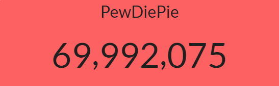
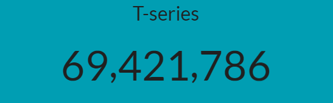
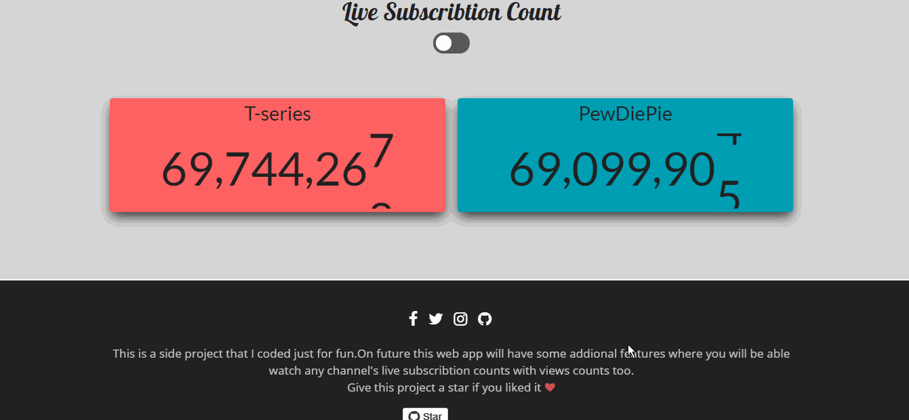

# Youtube Live Subscriber Count

This is a fun web applicaton that lets you check live youtube subcribtion of youtube channels . [Currently it only serves two channel's subscribtion as default ,But live subscribtion counts will be available for any youtube channel in future, W.I.P]

  

----

This project is live here [https://livecounting.herokuapp.com/](https://livecounting.herokuapp.com/)

---

# Tech Stack
----
* Webpack: Bundling 
* Babel: ES6 Compiler
* SASS: styled-components
* youtube v3 api : Data

# License
----

The MIT License (MIT)

Copyright (c) 2018 Rocktim Saikia

Permission is hereby granted, free of charge, to any person obtaining a copy
of this software and associated documentation files (the "Software"), to deal
in the Software without restriction, including without limitation the rights
to use, copy, modify, merge, publish, distribute, sublicense, and/or sell
copies of the Software, and to permit persons to whom the Software is
furnished to do so, subject to the following conditions:

The above copyright notice and this permission notice shall be included in all
copies or substantial portions of the Software.